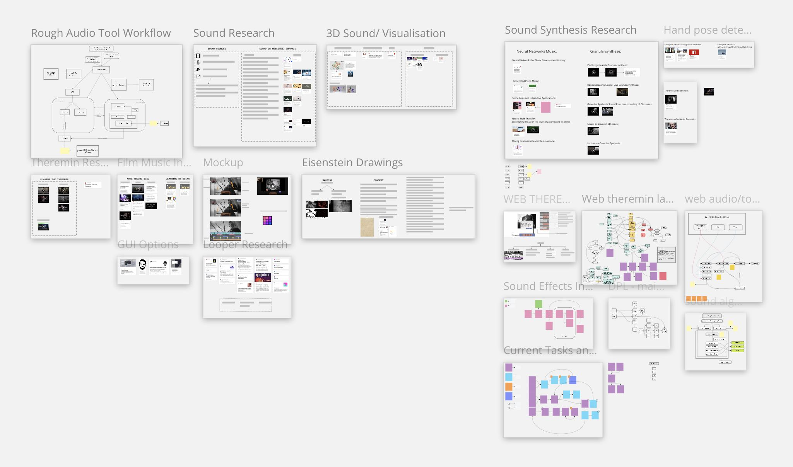

# Dokumentation


* [Projektbeschreibung](#projektbeschreibung)
* [Implementierung](#implementierung)
  * [Web Theremin](#web-theremin)
  * [Grafische Formeln](#grafische-formeln)
  * [Schnittstellen zu Infovis und VR](#schnittstellen-infovis-vr)
* [Publikationen](#publikationen)

## Projektbeschreibung 

Ziel des Teilbereichs 3D-Sound war es, das Potenzial von 3D-Sound für die nichtlineare Narration komplexer Datenbestände in Form interaktiver VR- und InfoVis-Interfaces zu erforschen. Zu Beginn des Arbeitsprozesses ging es um eine Kontextualisierung des Arbeitsbereichs 3D-Sound in Bezug auf die Bereiche VR und InfoVis und das Erstellen einer Roadmap. Schwerpunkt der Arbeit war zunächst die Recherche von technischen Möglichkeiten, 3D-Sound einerseits als Teil einer eigenständigen Web-Experience zu etablieren und andererseits als Medienbrücke in VR und InfoVis zu integrieren. Der Einsatz des 3D-Sounds als Medienbrücke zwischen VR und InfoVis wurde zunächst über den Anwendungskontext adressiert. In diesem Zusammenhang  wurden Möglichkeiten der interaktiven prozeduralen Soundgenerierung sowie der Verwendung Sample-basierter Soundquellen identifiziert.

Nach der Erforschung geeigneter Audioformate erfolgte eine Anwendungs- und Integrationsanalyse von 3D-Sound für die Bereiche InfoVis und VR. Hierfür wurden verschiedene 3D Web-Bibliotheken für Web XR/VR evaluiert, allen voran Babylon.js und Three.js sowie die grundlegenden APIs WebGL, WebVR und WebAudio. Diese wurden hinsichtlich ihrer Einsatz- und Anbindungsmöglichkeiten an die im VR- und InfoVis-Team verwendeten Anwendungen untersucht. Zudem wurden synthetische Soundgenerierungsmöglichkeiten, die auf der Granularsynthese basierten, entwickelt.

Auf Basis der Anwendungs- und Integrationsanalyse und der eingeschränkten technischen Möglichkeiten, eine direkte Schnittstelle zwischen Web-Anwendung und VR-Experience herzustellen, entschied sich das 3D-Sound-Team dazu, ein virtuelles Theremin zur Generierung von synthetischen Tönen zu entwickeln, welches als digitales Musikinstrument (DMI) interaktiv genutzt und zur spielerischen Auseinandersetzung mit Filmtonkomposition eingesetzt werden kann. Das virtuelle Theremin stellt somit einerseits eine Medienbrücke zwischen 3D-Sound und der VR-Erfahrung dar. Andererseits stellt es auf inhaltlicher Ebene eine direkte Verbindung zu Sergei Eisensteins Konzeption synthetischer Musik für seinen Film „Die Generallinie“ her. Zur Entwicklung und iterativen Implementierung des virtuellen Theremins  wurde ein erster prototypischer Entwurf (Mockup) erstellt. Dabei ging es unter anderem um die Analyse der Bedarfsanforderungen, Entwicklung und Ausgestaltung von einem geeigneten Graphical User Interface (GUI), der Gestenerkennung, der Interaktion der Soundeffekte und des Gesamtlayouts. Die Umsetzung des Mockups erfolgte mit verschiedenen Web-basierten Bibliotheken, u.a., Tone.js zur Audio- und Musikverarbeitung, ml5.js und PoseNet zur machine-learning-basierten Gestenerkennung und p5.js zur allgemeinen Interaktion und Benutzung. 

Nach iterativen Implementierung des Live Tools kam die Phase der Evaluation, Anpassung und Weiterentwicklung der Web-Anwendung. Die Evaluation des digitalen Theremins erfolgte einerseits durch Testfragebögen und Evaluationsgesprächen mit anderen Teammitgliedern des Projekts. Andererseits wurde das Live-Tool auf der Konferenz „Kultur und Informatik“ der HTW Berlin präsentiert und diskutiert. Für die Veranstaltung wurde zudem ein wissenschaftliches Paper über das Live-Tool geschrieben – die Publikation des Papers erfolgte später im [Journal for Interactive Media](https://www.degruyter.com/document/doi/10.1515/icom-2022-0007/html).

[Link zur Projektwebsite](https://eisensteinshouse.projekte-filmuni.de/)


## Implementierung

Für die Zusammenarbeit an dem Projekt wurden vor allem **miro** und **github** verwendet. Auf diversen miro boards wurden unter anderem Ideen gesammelt, Brainstorming Workshops durchgeführt, Rechercheergebnisse aufgelistet und Systemdiagramme erstellt.



### Web-Theremin

Das Web-Theremin ist eine digitales Instrument zur Begleitung von Eisensteins Filmen. Das Theremin lässt sich über Gesten mit beiden Händen steuern. Es gibt verschiedene Sounds und Effekte zum experimentieren.
[Link zum Theremin](https://ctechfilmuniversity.github.io/eisenstein-theremin-app/)


Das Web-Theremin hat sich durch mehrere User Interface Tests immer weiterentwickelt. Zu Beginn war das Theremin noch in einer 3D Web-App. 


### Grafische-Formeln

#### Das Zusammenspiel zwischen Bild und Ton 
> _"[Der Komponist] muss die Montagebewegung sowohl über das System aller montierten Teile als auch die Bewegung innerhalb jeder Einstellung erfassen und diese Bewegung dann zur Grundlage seiner bildlich-musikalischen Komposition machen”_ 
<sub>(Eisenstein - die Vertikalmontage p. 259-300)</sub>

Eisenstein hatte einen hohen Anspruch an dem Zusammenspiel zwischen Bild und Ton. Ein Thema, welches ihn viel beschäftigte,  war die Entstehung von Bild auf Basis der Musik und umgekehrt.

So schrieb er zum Übergang von Ton zu Bild, dass die Bewegung eines Musikabschnitts erfasst werden muss, um dann die Spur dieser Bewegung, also ihre Linie oder Form, zur Grundlage jener bildlichen Komposition zunehmen. Dadurch entstehe eine Korrespondenz zwischen der Musik und dem Bild.

Umgedreht ist es die Aufgabe der Komponist*innen unter anderem folgende Eigenschaften der Szene zur Grundlage der bildlich-musikalischen Komposition zu machen:
- die Montagebewegung zwischen verschiedener Einstellungen
- Helligkeits- und Farbschattierungen der Bildkomposition
- visuelles Spiel zwischen figürlichen Umrissen und Raum
- Rhythmus der Einstellung

Eisenstein berichtet von einer verallgemeinerten plastischen Verkörperung der Grundzüge jenes Bildes, durch das sich das Thema des Films offenbart.

Zusätzlich fertigte Eisenstein Zeichnungen an, die das Zusammenspiel von Bild und Ton darstellen. Er erweiterte Zeichnungen von Filmszenen mit abstrakten geometrischen Formen, welche als "grafische Formeln" für die audiovisuelle Zusammenführung dienen. Blau steht für das Bild und rot steht für die Musik.

#### Generierung von grafischen Formeln zur Filmmusik-Komposition

Basierend auf Eisensteins Theorien wollen wir unser digitales Theremin um die genannten abstrakten Zeichnungen erweitern.

Aus dem Film soll aus jeder Einstellung eine abstraktes grafisches Element generiert werden. Dafür werden die Sequenzen in zwei Dimensionen analysiert. Im ersten Teil wird die visuelle Komplexität des Bildes untersucht, wie z.B. die Helligkeits- und Farbschattierungen sowie Kantendetektion. In der zweiten Dimension wird die Bewegung einer Einstellung analysiert. Dazu gehören Parameter wie Geschwindigkeit und Montagerhythmus.

Diese generierten grafischen Elemente dienen anschließend als Impuls für Handbewegungen zum Spielen des Theremins. Somit knüpfen wir an Eisensteins Eisensteins Theorien zum Zusammenspiel zwischen Bild und Ton an.

Quellen: Eisenstein, die Vertikalmontage S. 259-300, Eisenstein on Paper S. 166/167

>_"In blue ink, Eisenstein drew the Battle on the Ice: moments from the fight between the Teutonic Knights and the warriors of Alexander Nevsky. In red pencil, he added abstract geometrical figures, which, however, sometimes clearly recalled horses. But these were not sketches for the film, whether in style or in meaning. They can be defined as ‘graphic formulae’ for the audiovisual combinations in the cinema: the blue standing for the image and the red for the music."_ 
<sub> (Eisenstein on Paper p. 166/167)</sub>


### Tests


### Schnittstellen-Infovis-VR

## Publikationen

The Virtual Theremin: Designing an Interactive Digital Music Instrument for Film Scene Scoring - Journal for Interactive Media
https://doi.org/10.1515/icom-2022-0007


## das können wir am ende löschen
### Welcome to GitHub Pages

You can use the [editor on GitHub](https://github.com/ctechfilmuniversity/kollisionen/edit/main/README.md) to maintain and preview the content for your website in Markdown files.

Whenever you commit to this repository, GitHub Pages will run [Jekyll](https://jekyllrb.com/) to rebuild the pages in your site, from the content in your Markdown files.

### Markdown

Markdown is a lightweight and easy-to-use syntax for styling your writing. It includes conventions for

```markdown
Syntax highlighted code block

# Header 1
## Header 2
### Header 3

- Bulleted
- List

1. Numbered
2. List

**Bold** and _Italic_ and `Code` text

[Link](url) and 
```

For more details see [Basic writing and formatting syntax](https://docs.github.com/en/github/writing-on-github/getting-started-with-writing-and-formatting-on-github/basic-writing-and-formatting-syntax).

### Jekyll Themes

Your Pages site will use the layout and styles from the Jekyll theme you have selected in your [repository settings](https://github.com/ctechfilmuniversity/kollisionen/settings/pages). The name of this theme is saved in the Jekyll `_config.yml` configuration file.

### Support or Contact

Having trouble with Pages? Check out our [documentation](https://docs.github.com/categories/github-pages-basics/) or [contact support](https://support.github.com/contact) and we’ll help you sort it out.
